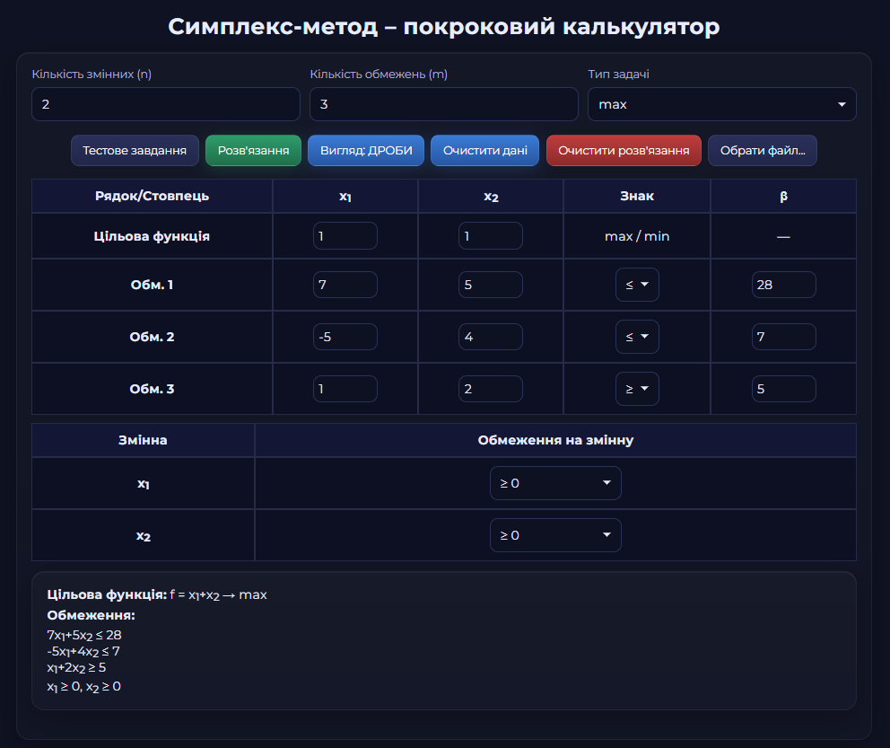

# Симплекс-метод – Покроковий калькулятор 

Інтерактивний веб-застосунок для покрокового розв'язання задач лінійного
програмування симплекс-методом. Цей інструмент призначений не тільки для
отримання відповіді, але й для навчання, оскільки він детально візуалізує кожен
етап алгоритму та надає розгорнуті пояснення.

## 🚀 Основні можливості

- **Динамічна форма:** Автоматична генерація таблиць для введення даних на
  основі заданої кількості змінних (n) та обмежень (m).
- **Два режими розв'язання:**
  - **Двоетапний симплекс-метод:** Для задач із обмеженнями типу `≥` або `=`.
  - **Класичний симплекс-метод:** Для простих задач з обмеженнями `≤`.
- **Підтримка різних обмежень:** Можливість задавати обмеження на знак для
  кожної змінної (`≥ 0`, `≤ 0`, або вільна/необмежена).
- **Робота з дробами:**
  - **Перемикач вигляду:** Кнопка для динамічного перемикання відображення всіх
    розрахунків між **звичайними** та **десятковими** дробами.
- **Графічний метод:** Автоматична побудова графічного розв'язку для задач з
  двома змінними за допомогою бібліотеки **JSXGraph.js**.
- **Детальні пояснення:** Генерація розгорнутих текстових пояснень для кожного
  кроку симплекс-методу в академічному стилі.
- **Завантаження завдань:** Можливість завантажувати приклади завдань з
  локального `JSON` файлу.
- **Адаптивний дизайн:** Інтерфейс коректно відображається на пристроях з різною
  шириною екрана (Mobile First).

## 🛠️ Використані технології

- **Vite:** Сучасний інструмент для швидкої розробки та збірки веб-проєктів.
- **HTML5, CSS3, JavaScript (ES Modules):** Основа веб-застосунку.
- **Fraction.js:** Бібліотека для точної роботи зі звичайними дробами.
- **JSXGraph.js:** Бібліотека для побудови інтерактивних геометричних графіків.

## 📖 Як користуватися

1.  **Встановіть розмірність:** Вкажіть кількість змінних (n) та обмежень (m).
    Форма автоматично оновиться.
2.  **Введіть дані:** Заповніть коефіцієнти цільової функції та матриці
    обмежень. Можна вводити як цілі числа, так і десяткові або звичайні дроби
    (наприклад, `3/4`).
3.  **Налаштуйте обмеження:** Оберіть знаки нерівностей (`≤`, `≥`, `=`) та
    обмеження на знак для кожної змінної.
4.  **Натисніть "Розв'язання"**, щоб побачити покрокове виконання алгоритму.
5.  **Перемикайте вигляд:** Використовуйте кнопку **"Вигляд: Дроби /
    Десяткові"**, щоб змінити формат відображення чисел у вже згенерованих
    таблицях.
6.  **Завантаження з файлу:**
    - Натисніть "Обрати файл..." та виберіть `JSON` файл.
    - Файл має містити масив об'єктів, де кожен об'єкт — це задача з полями:
      `id`, `name`, `numVars`, `numCons`, `problemType`, `c`, `a`, `b`, `sign`,
      `varbound`.
    - Після вибору файлу з'явиться випадаючий список із завданнями.
    - Оберіть потрібне завдання та натисніть "Завантажити обране".

## 📂 Структура проєкту

- `/index.html` - Головний HTML-файл.
- `/public/` - Папка для статичних файлів (наприклад, `favicon`).
- `/src/` - Папка з усім вихідним кодом.
  - `/src/main.js` - Головний вхідний файл JavaScript.
  - `/src/styles.css` - Головний файл стилів.
  - `/src/js/` - Папка з усіма JS-модулями.
    - `uiController.js` - Головний модуль, що керує логікою інтерфейсу.
    - `algorithms/` - Модулі з реалізацією алгоритмів (симплекс-метод, метод
      Гаусса).
    - `renderers/` - Модулі, що відповідають за відображення (рендерінг) HTML.
    - `problem/` - Модулі для роботи з даними задачі (парсер, приклади).
    - `core/` - Модулі для керування станом.
    - `utils/` - Допоміжні функції (форматування чисел).
